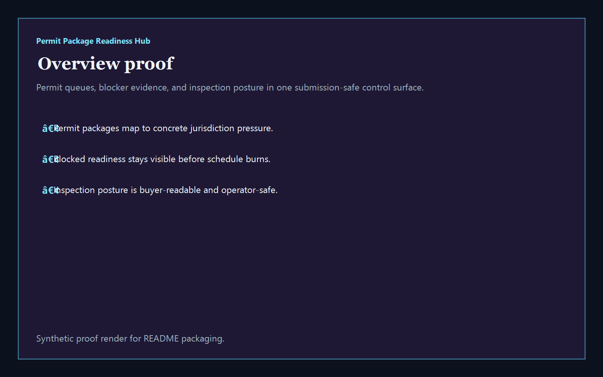
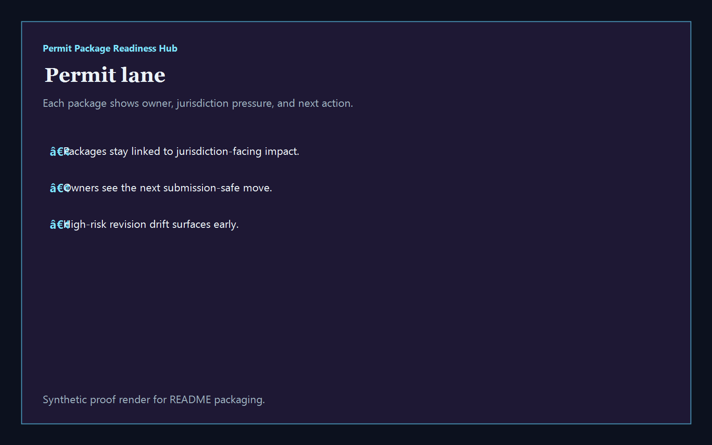
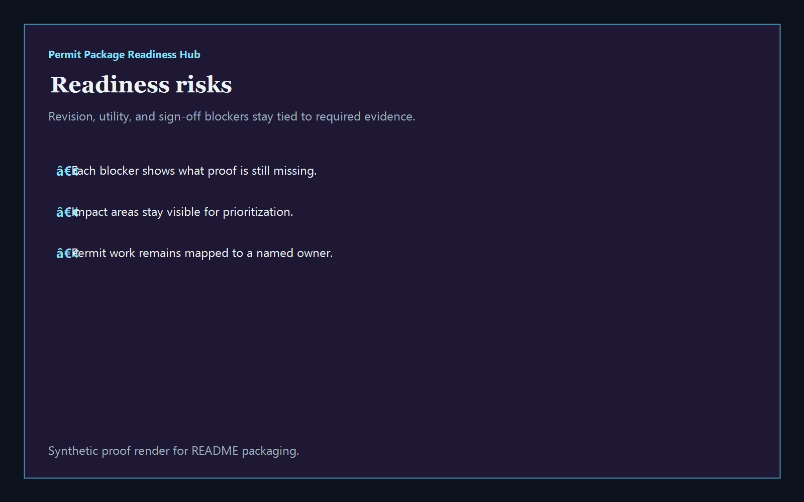
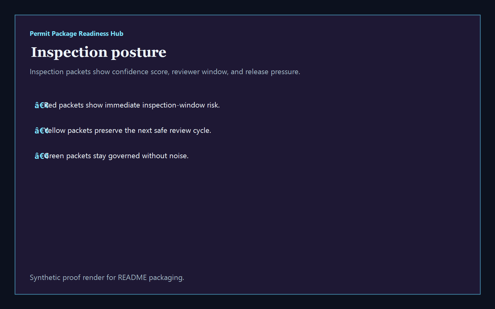

# Permit Package Readiness Hub

[](https://github.com/mizcausevic-dev/permit-package-readiness-hub/actions/workflows/ci.yml)
[](./LICENSE)
[](./.github/dependabot.yml)
[](https://github.com/mizcausevic-dev/permit-package-readiness-hub/actions/workflows/pages.yml)

TypeScript control plane for permit packages, readiness blockers, inspection posture, and construction-safe submission operations.

## Why this exists

- Construction teams lose schedule trust when revision parity, utility sign-off, and inspection packets drift in different places at different speeds.
- Permit readiness needs a clear view of which packages are live, which blockers still need proof, and which inspection-facing packets should not move yet.
- Construction Tech buyers care whether submittal and inspection operations can stay safe without fragmenting PM, field, and jurisdiction-facing workflows.
- Operators want tooling that turns permit chaos into governed package lanes, named ownership, and measurable submission posture.

## Why this matters (KG Embedded tie-back)

This repo demonstrates the permit-readiness primitive for Construction Tech buyers: packages, blockers, and inspection-facing posture tied into one operator surface. A B2B SaaS buyer would care because permit, field, and readiness data often need to surface inside customer-facing products without exposing unsafe write paths or fragmented operational evidence. Kinetic Gain Embedded extends this into security-first in-product analytics for permit readiness, inspection cadence, and field workflows, see [kineticgain.com/embedded](https://kineticgain.com/embedded).

## Routes

- `/`
- `/permit-lane`
- `/readiness-risks`
- `/inspection-posture`
- `/verification`
- `/docs`

## API

- `/api/dashboard/summary`
- `/api/permit-lane`
- `/api/readiness-risks`
- `/api/inspection-posture`
- `/api/verification`
- `/api/sample`

## Screenshots






## Local Development

```powershell
cd permit-package-readiness-hub
npm install
npm run dev
```

Open:
- [http://127.0.0.1:5550/](http://127.0.0.1:5550/)
- [http://127.0.0.1:5550/permit-lane](http://127.0.0.1:5550/permit-lane)
- [http://127.0.0.1:5550/readiness-risks](http://127.0.0.1:5550/readiness-risks)
- [http://127.0.0.1:5550/inspection-posture](http://127.0.0.1:5550/inspection-posture)
- [http://127.0.0.1:5550/verification](http://127.0.0.1:5550/verification)

## Validation

- `npm run build`
- `npm run test`
- `npm run coverage`
- `npm run demo`
- `npm run smoke`
- `npm run prerender`
- `npm run render:assets`

## Docs

- [Architecture](./docs/architecture.md)
- [Origin](./docs/ORIGIN.md)
- [Kinetic Gain Embedded tie-back](./docs/KINETIC_GAIN_EMBEDDED.md)
- [Changelog](./CHANGELOG.md)
